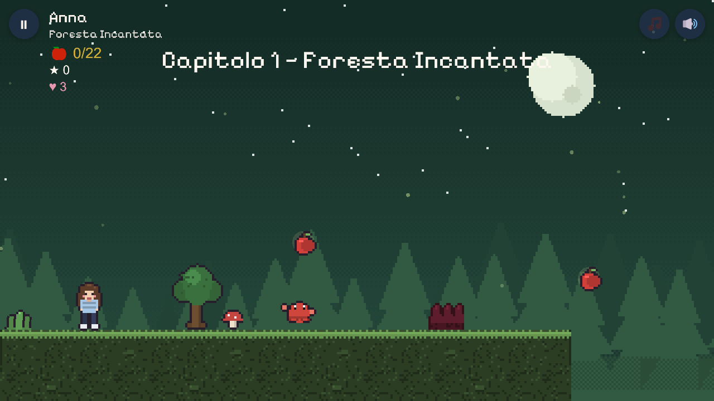

# 👑 The Princess Journey



**[▶ Play it live](https://gameforprincess.vercel.app)** · License: MIT · Built with [Kaplay](https://kaplayjs.com/) — no build step

A complete 2D platformer that runs in the browser, born as a personalized gift and grown into a
small, polished arcade game. Pick a heroine, cross **six themed worlds**, beat a **multi-phase
boss**, and reach the **Sala da Ballo** finale — on desktop or phone, online or offline.

It plays as an **arcade run**: 3 lives, deaths cost a life (and 500 Coccoline 😏), losing them all
restarts from level 1, and finishing posts your score to a **global leaderboard**.

## Highlights

- 🗺️ **Six themed levels + a finale** — forest, coral abyss, oriental rooftops, snowy peaks,
  twilight garden, royal castle. Levels are pure **data** (ASCII tile maps), so the world builds
  itself from `src/levels/*.js` with no per-level rendering code.
- 👑 **Multi-phase final boss** — the *Custode di Pietra* hovers out of reach, rains shockwaves and
  debris, then dives into a window where a stomp wounds it. Deliberately softlock-proof.
- 👗 **Skin progression** — each cleared level layers on a new clothing piece (skirt → … → royal
  cape), rendered as stacked sprites on the same heroine.
- 📱 **Mobile-first & PWA** — landscape touch controls, iOS audio-unlock handling, safe-area
  aware, and installable to the home screen with **offline play** via a service worker.
- 🏆 **Global leaderboard** — a Vercel serverless function backed by Upstash Redis; degrades
  gracefully to "hidden" when offline or unconfigured.
- 🎨 **100% generated assets** — every sprite, tile, parallax background and music/SFX track is
  procedurally generated by `tools/gen/` (deterministic) — no third-party art packs.

## Tech stack

Vanilla **JavaScript ES modules**, **no build step**: [Kaplay](https://kaplayjs.com/) is vendored
(`vendor/kaplay-3001.0.19.mjs`) and imported directly, so the game is just static files served
as-is. **`src/config.js`** is the single source of truth (resolution, palette, characters, skins,
physics, assets). DOM/HTML UI (`src/ui/`) is isolated from the gameplay/collision logic
(`src/scenes/game.js`). Deployed on **Vercel**; browser tests run in real Edge via
`playwright-core` (the only dev dependency).

Performance work that makes it smooth on a real iPhone: `pixelDensity: 1` on touch devices,
off-screen culling of draws, and greedy-meshed solid colliders — see [`CLAUDE.md`](CLAUDE.md) for
the engineering notes and gotchas.

## Run it locally

ES modules need an HTTP server (opening `index.html` via `file://` won't work):

```bash
python tools/serve.py 8137      # or: npm run serve
```

Then open <http://localhost:8137> and play (on mobile, hold the phone in **landscape**).
Tests: `npm install` once, then `npm test`. Deploy: `npm run deploy` (reads `VERCEL_TOKEN` from a
gitignored `.env`).

## Controls

- **Desktop:** ◀ ▶ move · **Space / ↑** jump · **Esc** pause.
- **Mobile:** on-screen D-pad + jump button + pause, shown only during play.

## The worlds

| # | World | Twist |
|---|-------|-------|
| 1 | Foresta Incantata | running, ravines, brambles, forest critters |
| 2 | Abissi di Corallo | sea-urchin hazards, patrolling crabs |
| 3 | Tetti d'Oriente | flying obstacles over pagoda rooftops |
| 4 | Cime Innevate | stalactites that drop and reset |
| 5 | Giardino del Crepuscolo | breeze columns that carry you on long glides |
| 6 | Castello Reale | pendulum chandeliers + the **Custode di Pietra** boss |
| 7 | Sala da Ballo | the finale — heroine in all six skins + a personalized note |

## Built with AI — how this was made

This project was designed and built by **[Vito D'Elia](https://github.com/VTvito)** in close
collaboration with **[Claude Code](https://claude.com/claude-code)** (Anthropic's agentic coding
assistant) — architecture, level/boss design, the procedural asset pipeline, the test harness, and
the iOS/PWA performance work — with a human in the loop steering direction, reviewing every change,
and testing on real devices.

A small showcase of **agentic, AI-assisted development**: human product taste and on-device QA
paired with an AI agent that refactors, generates assets, and writes tests across the whole
codebase. Curious about the workflow? Open an issue.

## Credits & license

- **Engine:** [Kaplay](https://kaplayjs.com/) `3001.0.19` — MIT, vendored.
- **Font:** [Pixelify Sans](https://github.com/eifetx/Pixelify-Sans) — SIL Open Font License.
- **Art & audio:** original, procedurally generated by `tools/gen/` — no third-party packs.
- **Code:** © 2026 Vito Delia, released under the **[MIT License](LICENSE)**.
